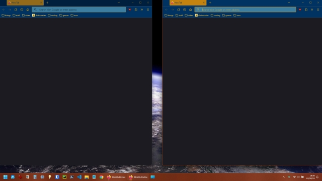

# openAndAlign

A class to automate opening your favorite Windows applications and aligning them on the desktop. Created for
Professional Portfolio Project: Assignment 17: Angela Yu 100 Days of Code -- "Python Automation: Custom Automation".

This project is fairly simple and small in scope, but solves very directly and effectively a task which I've been
seeking to automate for some time now, i.e. opening up my dual Firefox windows to either side of the screen in an exact
and organized manner. Not a big deal, by any means, but very helpful and fun to watch work.

This is how I like my Firefox windows to be set up:



I've often wondered if there was a way to achieve this kind of functionality via a Firefox extension, but haven't found
one that opens windows to a pre-ordained configuration with this kind of precision. Perhaps future versions can include
an extension...

I used PyAutoGUI on a previous project to automate the Google Dinosaur Game, and I'd heard of and browsed Al Sweigart's
famous book, [Automate the Boring Stuff with Python](https://automatetheboringstuff.com/) before, but this is the first
time I've I put two and two together and realized that this is his library. Kudos to him -- such a useful and fun
module!

### Resources Utilized

- [Python](https://www.python.org/)

- [pywin32](https://github.com/mhammond/pywin32) (`win32gui` in imports)

_MIT License: Copyright (c) 2024- Andrew Blais_

---

### Recent Updates

- 04/27/24: Add functionality to modify Windows 'Night Light' setting.

---

### Future Updates

- Provide functionality to utilize across Linux and Mac as well.

- Clarify and improve math and algorithms involved in determining different and best screen coordinates for app windows.

- Create an executable .exe to run this without opening an IDE.

- more...

---

### Documentation:

```requirements
PyAutoGUI>=0.9.54
pywin32>=306
```

_Docstrings for `main.py`:

```
Help on class OpenAndAlign in module __main__:

class OpenAndAlign(builtins.object)
 |  OpenAndAlign(app_name: str, image_file_name: str, desired_win_loc: list = [0, 0], align_right: bool = False, confidence: float = 0.9)
 |
 |  A class to automate the process of opening an application and aligning its window.
 |
 |  :param app_name: The name of the application to open via the Start Menu.
 |  :type app_name: str
 |  :param image_file_name: The file name of the image to be located on the screen.
 |                          User creates and stores this image file in the 'static'
 |                          project folder.
 |  :type image_file_name: str
 |  :param desired_win_loc: The desired window location coordinates. Defaults to (0, 0).
 |  :type desired_win_loc: list, optional
 |  :param align_right: Whether to align the window to the right side of the screen.
 |                      Defaults to False.
 |  :type align_right: bool, optional
 |  :param confidence: The confidence threshold for image recognition. Defaults to 0.9.
 |  :type confidence: float, optional
 |
 |  :ivar app_name: The name of the application to open via the Start Menu.
 |  :type app_name: str
 |  :ivar image_file_name: The file name of the image to be located on the screen.
 |                         User creates and stores this image file in the 'static'
 |                         project folder.
 |  :type image_file_name: str
 |  :ivar desired_win_loc: The desired window location coordinates. Defaults to (0, 0).
 |  :type desired_win_loc: list
 |  :ivar align_right: Whether to align the window to the right side of the screen.
 |                     Defaults to False.
 |  :type align_right: bool
 |  :ivar screen_w: The width of the screen.
 |  :type screen_w: int
 |  :ivar app_left: The left coordinate of the located application window.
 |  :type app_left: int
 |  :ivar app_top: The top coordinate of the located application window.
 |  :type app_top: int
 |  :ivar corner_avoid_val: The value to avoid the corner of the screen.
 |  :type corner_avoid_val: int
 |  :ivar right_adjust_val: The value to adjust for aligning the window to the right side.
 |  :type right_adjust_val: int
 |  :ivar confidence: The confidence threshold for image recognition. Defaults to 0.9.
 |  :type confidence: float
 |
 |  Methods defined here:
 |
 |  __init__(self, app_name: str, image_file_name: str, desired_win_loc: list = [0, 0], align_right: bool = False, confidence: float = 0.9)
 |      Initialize self.  See help(type(self)) for accurate signature.
 |
 |  app_drag(self, desired_win_locations: list) -> None
 |      Moves mouse cursor to upper left of app window and drags to desired location.
 |
 |      :param desired_win_locations: The desired window location coordinates.
 |
 |      :return: None
 |
 |  app_locate(self, image_file_name: str) -> None
 |      Locates the specified image on the screen. User must crop a screenshot an image
 |       representing the upper-left part of the app to identify the app to pyautogui.
 |      Store this image in the project 'static' folder.
 |
 |      :param image_file_name: The file name of the image.
 |      :type image_file_name: str
 |
 |      :return: None
 |
 |  app_open(self, app_name: str) -> None
 |      Opens the specified application via the Start Menu.
 |
 |      :param app_name: The name of the application.
 |      :type app_name: str
 |
 |      :return: None
 |
 |  right_move(self) -> int
 |      Adjusts values based on window width so window will be snug against right
 |       side of computer screen.
 |
 |      :return: The adjusted x-coordinate.
 |      :rtype: int | float
 |
 |  run_program(self) -> None
 |      Runs the program and all relevant class methods to open the application and
 |       align its window.
 |
 |      :return: None
 |
 |  screen_w_val(self) -> None
 |      Gets the width of the screen.
 |
 |      :return: None
 |
 |  ----------------------------------------------------------------------
 |  Static methods defined here:
 |
 |  error_handling(exception: Exception) -> None
 |      Static method to handle errors that might arise.
 |
 |      :return: None
 |
 |  ----------------------------------------------------------------------
 |  Data descriptors defined here:
 |
 |  __dict__
 |      dictionary for instance variables
 |
 |  __weakref__
 |      list of weak references to the object
```

---

## Created in completing an assignment for Angela Yu Course 100 Days of Code: The Complete Python Pro Bootcamp.

### **Day 98, Professional Portfolio Project [Python Automation]**

#### **_Assignment 17: "Custom Automation"_**

Automate some aspect of your life using Python.

### **Assignment instructions:**

You've learnt about automation with Python and Selenium. It's your turn to get creative
and automate some aspect of your life using what you have learnt.

This could be an aspect of your job, your schoolwork, your home, your chores. Think about
your week and everything that you do on a regular basis, when do you feel like a robot?
Which jobs do you find tedious and boring? Can it be automated?

Here are some stories for inspiration:

- Automate an email to your boss to ask for a raise every 3 months. =)

- Automate your lights so they switch on when your phone is within the radius of your
  house.

- Automatically organise the files in your downloads folder based on file type.

- Automate your gym class bookings.

- Automate your library book renewals.

- Automate your job:
  https://www.reddit.com/r/learnpython/comments/boywle/what_work_activity_have_you_automated/

- Automate your home chores:
  https://www.reddit.com/r/Python/comments/9lp1mn/so_what_have_you_automated_at_home/

Personally, I had a job in a hospital where I had to arrange all the doctors' shifts in
my department (normal day, long day, night shift). It would depend on when they wanted to
take annual leave/vacation and the staffing requirements. It started out in an Excel
spreadsheet, by the time I was done with it, it was fully automated with Python and
doctors were able to view a live version of the rota to see when they can take time off.
The code took an evening to write and it saves me 3 hours per week. (More time to watch
Netflix and eat ice cream).

Once you're done with the assignment, let us know what you automated in your life and
maybe it will inspire another student!

---

### My Submission:

My project is viewable here: https://github.com/andrewblais/OpenAndAlign

---

### **Questions for this assignment**

#### _Reflection Time:_

**_Write down how you approached the project._**

The Google Dinosaur automation project gave me the idea to automate the daily opening and aligning of Firefox windows,
which is a repetitive task that I like to have done in a very particular way.

Here's how I like the windows to be aligned:


This is a repeated activity which I often perform four or five times a day, so although not especially grand or complex
in nature, it serves a very useful and meaningful purpose to me.

**_What was hard?_**

The math/algorithm which takes into account the user's screen width and adjusts the right-hand window snugly to the
right side of the screen. I could have hard-coded the values, but wanted the extra challenge to make the code reusable
and modular for different screen sizes/laptops/desktops.

**_What was easy?_**

What at first was so, so difficult is now almost automatic -- writing a class and its methods and getting the whole
to work as an efficient, interdependent yet modular and responsive unit.

Also, I've grown quite fond of the ReStructuredText documentation style, and have even fine-tuned and customized it a
bit. Documentation syntax was also a challenge to understand at first, but its become a lot easier.

**_How might you improve for the next project?_**

I might want to spend more time planning and plotting out my goals and the overall structure before I dive into coding.

I have a tendency to let my creativity get the best of me and sometimes end up overwhelmed by lots and lots of ideas
are not always as organized as I'd like. This can lead to a period of catch-up, which might be prevented with better
planning up front.

**_What was your biggest learning from today?_**

Spending more time with PyAutoGUI has been very educational -- the possibilities seem endless...

Also, I learned about a library called `win32gui` from `pywin32`, which has a lot of cool, useful tools.

**_What would you do differently if you were to tackle this project again?_**

Better planning, slower and more methodical development process.

Consider writing the documentation as I go, rather than afterwards.